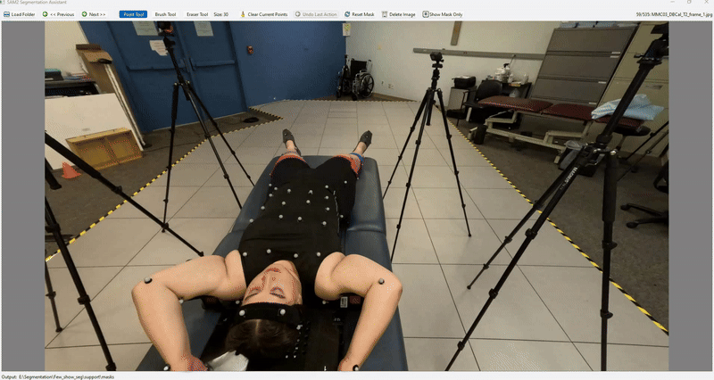

# SAM2 Segmentation Annotator

A powerful desktop application for interactive image segmentation using Meta's Segment Anything Model 2 (SAM2). This tool provides an intuitive interface for creating high-quality segmentation masks with support for point-based prompts, brush painting, and manual editing.


## GUI Preview

<p align="center">
  
</p>

*Animated demo of the SAM2 Segmentation Annotator interface and workflow.*


## ✨ Features

- **Multiple Annotation Tools**:
  - Point-based segmentation (positive/negative prompts)
  - Manual brush tool for painting masks
  - Eraser tool for refining annotations
- **Interactive Canvas**:
  - Zoom and pan capabilities
  - Real-time mask preview
  - Toggle between image and mask-only view
- **Workflow Optimization**:
  - Automatic jump to first unannotated image
  - Undo/redo functionality
  - Quick keyboard shortcuts
  - Session persistence (remembers last folders)
- **Batch Processing**: Work through entire image folders efficiently
- **Export**: Saves masks as PNG files

---

## 📋 Prerequisites

- Python 3.8 or higher
- CUDA-capable GPU (recommended for better performance)
- SAM2 model checkpoint and config files

---

## 🚀 Installation

### 1. Clone the Repository

```bash
git clone https://github.com/mohamedyousuf1/sam2-annotator/tree/master
cd Annotator
```

### 2. Create Virtual Environment (Recommended)

```bash
# Windows
python -m venv venv
venv\Scripts\activate

# Linux/Mac
python -m venv venv
source venv/bin/activate
```

### 3. Install Dependencies

```bash
pip install torch torchvision --index-url https://download.pytorch.org/whl/cu118
pip install opencv-python numpy PyQt6
```

### 4. Install SAM2

```bash
pip install git+https://github.com/facebookresearch/segment-anything-2.git
```

Or clone and install locally:

```bash
git clone https://github.com/facebookresearch/segment-anything-2.git
cd segment-anything-2
pip install -e .
cd ..
```

### 5. Download SAM2 Model Files

Download the model checkpoint and configuration file:

1. **Model Checkpoint**: Download `sam2.1_hiera_large.pt` from the [SAM2 releases](https://github.com/facebookresearch/sam2)
2. **Config File**: Download `sam2.1_hiera_l.yaml` from the SAM2 repository

Place both files in the `Annotator` directory.

### 6. Update Configuration

Edit `config.py` to set the correct paths for your model files, but edit it with your own paths for the model weights and yaml files:

```python
MODEL_CHECKPOINT_PATH = r"E:\Segmentation\Annotator\sam2.1_hiera_large.pt"
MODEL_CONFIG = r"E:\Segmentation\Annotator\sam2.1_hiera_l.yaml"
```

---

## 🎯 Usage

### Starting the Application

```bash
python main.py
```

### Basic Workflow

1. **Load Images**:
   - Click "Load Folder" or press `Ctrl+O`
   - Select the folder containing your images
   - Select the output folder for masks
   - The app will automatically jump to the first unannotated image

2. **Annotate Images**:
   
   **Point Tool (P)**:
   - Left-click: Add positive point (include this in mask)
   - Right-click: Add negative point (exclude this from mask)
   - SAM2 generates mask preview in real-time
   
   **Brush Tool (B)**:
   - Left-click and drag to manually paint mask areas
   - Adjust brush size with `[` and `]` keys
   
   **Eraser Tool (E)**:
   - Left-click and drag to remove mask areas
   - Adjust eraser size with `[` and `]` keys

3. **Navigate**:
   - Click "Next" or press `D`/`Right Arrow` to save and move to next image
   - Click "Previous" or press `A`/`Left Arrow` to save and move to previous image

4. **Refine**:
   - Press `C` to clear current points/preview
   - Press `Ctrl+Z` to undo last action
   - Press `R` to reset entire mask for current image
   - Press `Delete` to remove current image and its mask

5. **View Options**:
   - Press `V` or `T` to toggle between image+mask and mask-only view
   - Scroll mouse wheel to zoom in/out
   - Middle-click and drag to pan

### Keyboard Shortcuts

| Key | Action |
|-----|--------|
| `Ctrl+O` | Load folder |
| `P` | Switch to Point tool |
| `B` | Switch to Brush tool |
| `E` | Switch to Eraser tool |
| `[` | Decrease brush/eraser size |
| `]` | Increase brush/eraser size |
| `C` | Clear current points/preview |
| `Ctrl+Z` | Undo last action |
| `R` | Reset mask |
| `Delete` | Delete current image |
| `D` / `→` | Next image (saves current) |
| `A` / `←` | Previous image (saves current) |
| `V` / `T` | Toggle view mode |

---

## 📁 Project Structure

```
Annotator/
├── main.py                      # Application entry point
├── config.py                    # Configuration settings
├── model_loader.py              # SAM2 model loading
├── image_canvas.py              # Custom canvas widget
├── main_window.py               # Main application window
├── README.md                    # This file
├── .gitignore                   # Git ignore file
├── annotator_config.txt         # Session persistence
├── sam2.1_hiera_l.yaml         # SAM2 config (download separately)
├── sam2.1_hiera_large.pt       # SAM2 checkpoint (download separately)
├── assets/                      # Assets directory
└── support/                     # Support files
    ├── images/                  # Sample images
    └── masks/                   # Sample masks
```

---

## 🔧 Troubleshooting

### Model Files Not Found
- Ensure `sam2.1_hiera_large.pt` and `sam2.1_hiera_l.yaml` are in the correct directory
- Update paths in `config.py` if you placed them elsewhere

### CUDA Out of Memory
- Close other GPU-intensive applications
- Use a smaller model variant (e.g., `sam2.1_hiera_small.pt`)
- Set `DEVICE = "cpu"` in `config.py` (slower but works without GPU)

### SAM2 Import Error
- Ensure SAM2 is properly installed: `pip install git+https://github.com/facebookresearch/segment-anything-2.git`
- Check Python version (3.8+)

### Mask Not Saving
- Ensure output folder has write permissions
- Check that you're navigating to next/previous image (which triggers save)

---

## 💡 Tips for Best Results

1. **Point Tool**: Start with a few positive points, add negative points to refine
2. **Brush Tool**: Use for fine-grained control or when SAM2 misses small areas
3. **Combine Tools**: Use point tool for initial mask, then brush/eraser for refinement
4. **Zoom In**: Use scroll wheel to zoom for precise annotations
5. **Undo Frequently**: Don't hesitate to undo (`Ctrl+Z`) if result isn't perfect

---

## 🤝 Contributing

Contributions are welcome! Please feel free to submit issues and pull requests.

---

## 📄 License

This project uses SAM2 from Meta AI Research. Please refer to the [SAM2 repository](https://github.com/facebookresearch/segment-anything-2) for its license terms.

---

## 🙏 Acknowledgments

- Meta AI Research for [Segment Anything Model 2 (SAM2)](https://github.com/facebookresearch/segment-anything-2)
- PyQt6 for the GUI framework

---

## 📧 Contact

For questions or support, please open an issue on the GitHub repository.
